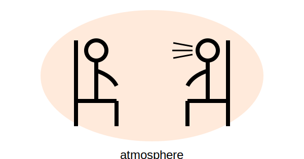

# Chapter Twenty-Three: Atmospheres and Frameworks

## Theme

| It is important to develop ... | Purpose |
| ---- | ---- |
| a special atmosphere | to hold the whole process |
| framework within which to work | to process the secondary one inf safe| 

  

  

> ### [memo] frame, framework in normal contexts?
> 
> | Term | Nuance | Definition, Meaning |
> | ---- | ------ | ------------------ |
> | frame | Physical, object-oriented | A rigid structure that surrounds something such as a picture, door, or windowpane. border, skeleton, structure, ... |
> | framework | Policy/methodology-oriented | Systematic operational policy for stable operations. groundwork, plan, scheme, structure, ... |

## 1. Atmosphere

It is important to develop a special atmosphere  
to hold the whole process

### Usage examples

- To free the client from GHOST.
- To create an atmosphere that the client feels safe and the therapist supportive.
	- The client feels punitive towards himself and sees even the therapist as potentially threatening.
- To free the client from altered state of consciousness.
- To create an atmosphere that allows the client to have some distance from the experiences.
	- If a client is in panic (altered states of consciousness) and hard to concentrate.

> Note: Subtle things may be crucial, even you never done consciously or remember it, though.

## 2. Framework

It is important to develop framework within which to work  
to safely process to the secondary one.

>### [memo] Auxiliary line
>
>#### Why framing the secondary process is necessary?
>
>- In the secondary process, the client doesn't have any clues in ordinary manner
>- Anything could arise
>- Even the therapist would be entangled in the conflict within the client - as described later
>
>So, how the client processes the work in such distressed situation?

### Frame and Framework as described in this chapter:

| Term | Nuance | Definition, Meaning |
| ---- | ------ | ------------------ |
| frame | Physical, object-oriented | A rigid structure that surrounds the secondary process |
| framework | Policy/methodology-oriented | Systematic operational policy to process secondary one |

Frame's functions:

- hold onto what has occurred
- make a space for what has occurred
- appreciate what has occurred

so that ... :

- ask the client to explore what happened cautiously (in slow motion, for instance)
- the client to notice subtle feelings that arise in connection with what happened

### Creating a framework

Frameworks could be created spontaneously, depending on the therapist's style and the atmosphere.

#### Clues to creating one:

- Talk to primary process about secondary
- Dream maps
- Ghost stories

#### Ideas:

- In a timely manner (for only 2 minutes, for instance)
- The therapist act out as the client did and give him/her chance to observe it
- Treat the conflict between the client and the therapist (perhaps as the client's defense)
	- so that the client can handle the situation and be conscious of what is happening
	- think about the situation together

#### An example (step by step):

1. A conflict arose between the therapist and the client.
2. The client said "doesn't want anyone in his space."
3. The therapist first showed respect for the client's needs.
4. Then proposed that she move toward the client little by little and check his feelings out.

#### Points for the example:

1. The client had full leadership and direction over the conflict situation
2. Set a framework to make him CONSCIOUSLY involved

## Overall

1. Client's safety
	- Developing framework within which the therapy safely processes.
2. Client's consciousness
	- Client him/herself can handle the situation.
3. Meta communications
	- Create framework flexibly with the flow of the process.
