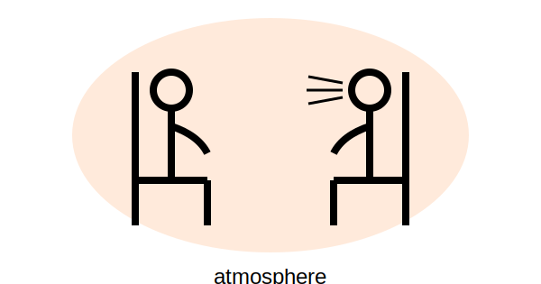
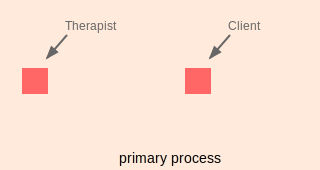
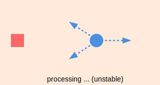
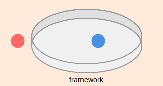

# 第23章：雰囲気とフレームワーク

## テーマ

| ワークの場で作るべきもの | 目的 |
| ---- | ---- |
| 特別な雰囲気 | プロセス全体を支えるための |
| ワークを進めるためのフレームワーク | 二次プロセスを安全に促進させるための | 

  

  

  

  

  

  

  

>### メモ: このテーマを理解するための「そもそもの前提」
>
>#### なぜ、二次プロセスにフレームワークが必要なのだろうか？
>
>- 二次プロセスでは、クライアントは通常の方法で手がかりを得られない
>- 二次プロセスでは、何が起こるかわからない
>- セラピストさえもクライアントの葛藤に巻き込まれる可能性がある(後述)
>
>このような困難な状況下で安心・安全にワークを進めるには？
>
> ### メモ: 一般的な文脈でのframe、frameworkとは？
> 
> | 用語 | ニュアンス | 定義・意味 |
> | ---- | ------------------ | ------ |
> | frame | 構造 |絵画、ドア、窓枠などを囲む固定的な構造物。 境界、骨格、構造、... |
> | framework | 手続き |安定した運用のための体系的な方針。 基盤、計画、枠組み、仕組み、... |

***

## 1. 雰囲気

特別な雰囲気を作る  
プロセス全体を支えるため

### 目的の例

- クライアントをGHOSTから解放するため
	- クライアントは他者の声に支配されていることがある
- クライアントが安全とセラピストからのサポーティブな雰囲気を感じられるようにするため
	- クライアントが自分自身を責める延長で、セラピストをも潜在的な脅威として見てしまうこともある
- クライアントを変性意識状態から解放するため
- クライアントが体験から適度な距離を取れる雰囲気を作るため
	- クライアントがパニック状態（変性意識状態）で集中が難しいこともある

### ポイント

常に、俯瞰できる自分であること

- メタスキルを活かして関わる
- 後ろに引いてみる
- 時間や空間を与えてみる

> メモ：セラピストが意識的に行っていない、覚えていないような微細なことも雰囲気作りに重要な意味を持つことがある

## 2. フレームワーク

ワークを進めるためのフレームワークを作る  
二次プロセスを安全に促進させるため

### 本章で述べられるフレームとフレームワーク：

| 用語 | ニュアンス | 定義・意味 |
| ---- | ------------------ | ------ |
| frame | 構造 | 二次プロセスを支える枠組み|
| framework | 手続き | 二次プロセスを進行させるときの決まりごと|

Frameの機能：

1. 起きた出来事を受け止める
2. 起きた出来事のための空間を作る
3. 起きた出来事を肯定的に認める(appreciate)

これにより：

- クライアントに、起こったことを慎重に探索するよう促せられる（たとえばスローモーションで）
- クライアントに、起こったことに関連して生じる微細な感覚に気づく余裕を与える

### フレームワークの作り方

フレームワークは、「セラピストのスタイル」と「そのワークの雰囲気」に応じ、自然に作られる

#### 作り方のヒント：

- 二次プロセスについて一次プロセスに話しかける:
	- 「今こんなことが起こっているようだけど、どう感じる？」
- ゴーストストーリー:
	- クライアントが/セラピストが演じてしまっている役割はないか？気づいたならば抜け出してみる
- ドリームマップ:
	- 夢全体のパターンを俯瞰してみる

#### アイデア：

- 時間的制約をかける（たとえば「2分だけやってみる」など）
- セラピストがクライアントの行動を演じて見せ、観察の機会を与える
- クライアントとセラピストとの間で生じた葛藤を扱う（このときは、クライアント側に立って行う）
	- クライアントが状況に対処できるように、何が起きているかを意識できるように
	- 状況について一緒に考える

#### 例（step by step）：

1. セラピストとクライアントの間に葛藤が生じた
2. クライアントは「自分の空間に誰も入ってほしくない」と言った
3. セラピストはまずクライアントのニーズを尊重した
4. セラピストは、「自分が少しずつクライアントに近づきながら、彼自身の感情の変化を確認してみること」を提案した

#### この例のポイント：

1. クライアントが葛藤状況における主導権と方向性を持つようにした
2. クライアントが状況に意識的に関われるようにフレームワークを設定した

## 全体として

1. クライアントの安全
	- 安全にプロセスを進められるようにフレームワークを作る
2. クライアントの意識・自主性
	- クライアント自身が状況に対処できるようにする
3. メタスキル/メタコミュニケーション
	- プロセスの流れに応じて柔軟にフレームワークを作る
